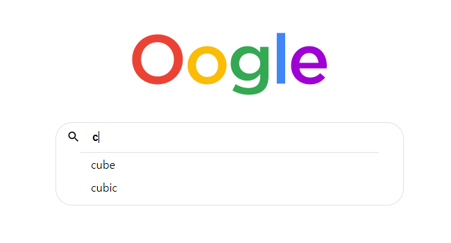

<<<<<<< HEAD
### oogle 자동완성

- 디자인 및 태그는 만들어져있는 상태로 index.js 만 작성했습니다.

1. 검색창에 `keyup` 이벤트를 줘서 `keyup` 이 있을 때마다 함수를 호출하도록 한다.

2. 함수 호출 시 `.fetch()` 를 사용해 API 를 호출. 호출시 인풋의 벨류를 가져와서 호출했으며 받아온 값들을 `li` 태그로 변환 시켜 `ul` 태그에 입력.

3. 작업이 끝나면 각 `li` 에 클릭이벤트를 걸어 클릭 시 인풋의 벨류가 클릭한 값으로 변하게 하고 함수 재호출

